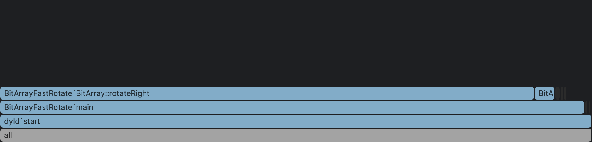

# Dynamic Bit Array with Fast Rotate Operation

A dynamic bit array implementation has been developed specifically for storing and managing 
time series data of neuron spikes. 
The existing [Boost dynamic_bitset](https://www.boost.org/doc/libs/1_82_0/libs/dynamic_bitset/dynamic_bitset.html) 
implementation lacks certain essential operations 
required for algorithms dealing with the [Clustering Coefficients](https://pubmed.ncbi.nlm.nih.gov/25339742/) problem.
Among these operations, the most crucial one is an efficient implementation of the 'rotate' or 'circular shift' function. 
Applying the rotate algorithm to each element (bit) is straightforward, 
with the [STL library](https://en.cppreference.com/w/cpp/algorithm/rotate) offering iterator-based 
implementations and implementing it for each bit of the set is also relatively simple. 
However, the Boost library only provides left and right shift operations using blocks 
of bits (e.g., uint8_t, uint16_t, uint32_t, or uint64_t) and does not include the 'rotate' operation. 
In our BitArray implementation, we address this issue by offering a block-based efficient alternative for rotation.
The "BitArray.hpp" is the dynamic bit array implementation and use as storage a std::vector<Block> 
which allocate the space in global heap. This structure is close to Boost dynamic_bitset<> type. 
The 'StaticBitArray.hpp' implements a counterpart of [std::bitset](https://en.cppreference.com/w/cpp/utility/bitset)
without heap allocation utilizing the idiom of Small Object Optimization. 

Another challenge we need to address is as follows: given two time series represented by bit arrays A and B, 
we want to determine the number of spikes (i.e., 'one bits') in B that occur to the left of the 
bits in A within a specified range, Dt. In other words, we want to identify if a spike in A coincides 
with or follows a spike in B within a time window of Dt. 
Similarly, we need to handle the case of spikes occurring in the right direction. 
To support these functionalities, we have defined two operations: 'CreateLeftNeighbourMask(int Dt)' 
and 'CreateRightNeighbourMask(int Dt)'. These operations set the left or right bits at a distance of Dt. 
With the help of these masks, the functions can be reduced to performing a bitwise 'and' (&) 
operation between two arrays and counting the number of 'one bits'."

There are three programs available for testing the operations and evaluating the efficiency of the rotate function. 
The TestBitArray.cpp and TestStaticArray.cpp programs specifically test the functionality of the 'rotate' 
and 'CreateMask' functions in dynamic and static versions of bit arrays. 
Additionally, the profiler produces an image displaying time periods for both the 
elementwise rotate operation (located on the left of the top row) and the 
blockwise efficient implementation (located on the right side). 
This image is generated by the profiler of [CLion IDE](https://www.jetbrains.com/clion/).

The third program, BenchRotate.cpp, utilizes the [Google Benchmark](https://github.com/google/benchmark) 
library to measure the execution time of the two versions of the rotate function. 
The obtained results are as follows: 
BM_Rotate represents our blockwise implementation of rotate, while BM_RotateRight corresponds 
to the elementwise implementation.

~~~
---------------------------------------------------------------
Benchmark                     Time             CPU   Iterations
---------------------------------------------------------------
BM_Rotate                109835 ns       109836 ns         5685
BM_RotateRight         14827976 ns     14827967 ns           47

BM_Rotate4Static         107789 ns       107787 ns         6360
BM_StaticRotate          105640 ns       105639 ns         6726
BM_StaticRotateRight   14682479 ns     14682280 ns           48
~~~

The functions we test split in two groups. In the first group we have the 'BM_Rotate and BM_RotateRight functions.
These are the two rotate functions of the dynamic bit array. In the second group we have the corresponding
two functions pf the static bit array, the BM_StaticRotate and the BM_StaticRotateRight. In this group we also
have the BM_Rotate4Static function which uses creates a dynamic bit array with the same elements with
the static bit array ana run the same 'rotate' operations. This way we compare the efficiency of all the 
rotate implementations. From the above table is obvious that the static bit array is outperforms.